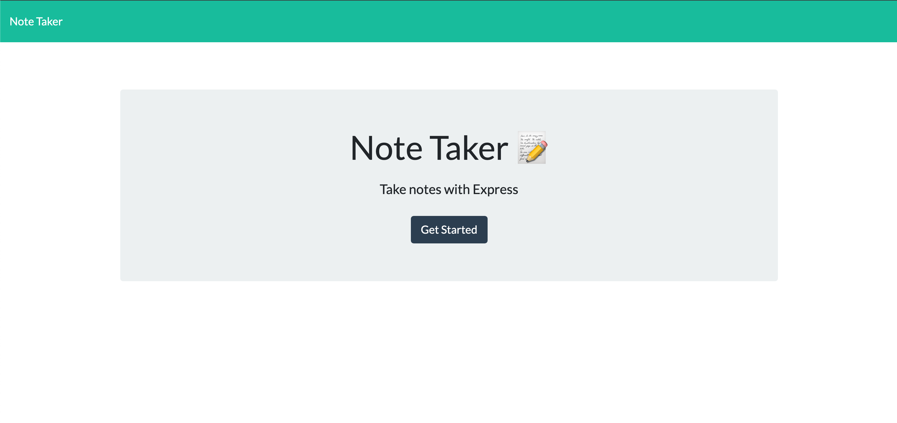
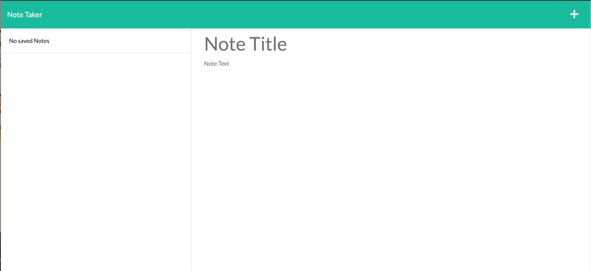
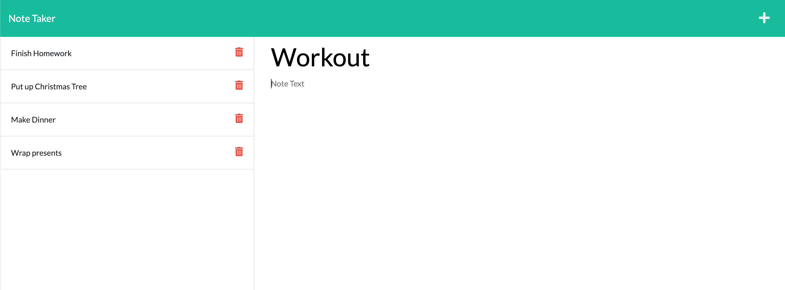

# Note Taker Express.js

## Description
This project was a challenge assigned to us where we had to create an application with an Express.js backend that can be used to write and save notes with the note data being saved and retrieved from a JSON file. We were given starter code that had a finised front end.

When you open the Note Taker app, you are presented with a landing page with a link to the notes page. After clicking the link, you are presented with a page with existing notes and empty fields to enter a title and text for a new note. You are able to click a save button at the top of the page and the new note shows up in the list. When you click on existing notes, they show up on screen and you are also able to delete notes from the list.

Even though we were given starter code, knowing where to begin was difficult for me and I had to be pointed in the right direction. Building the back end with Express.js and connecting it to the front end was a challenge for me. I still do not completely understand the syntax yet but it was good to have notes to reference and read documentation. The DELETE request was difficult because we were not shown or taught how to accomplish this, so it took many tries and some hints to get a working delete function. One of the issues I ran into was getting the syntax right for filter and for using some of the fsUtils that were in the starter code, when the switched two parameters in the writeFile function the DELETE worked! This is also my first app deployed to Heroku, so it was an extra step that I had to learn.

## User Story
```
- AS A small business owner
- I WANT to be able to write and save notes
- SO THAT I can organize my thoughts and keep track of tasks I need to complete
```

## Usage
This application allows users to add notes with a title and text and save them even after refreshing the page. This app also allows users to delete the notes.

[Link to Repository](https://github.com/crzn24/note-taker-expressjs.git)
[Deployed app]( https://note-taker-expressjs-crzn24.herokuapp.com/)





<!-- ## Credits
* []() -->


## License

MIT License


